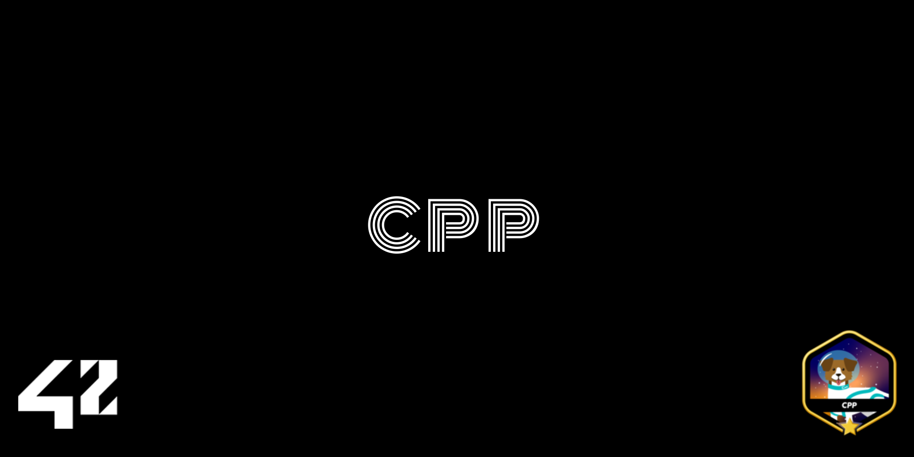

# CPP Modules 00-04



Welcome to the **CPP Modules** repository, a comprehensive series of projects designed to teach the fundamentals of C++ programming. Created as part of the 42 curriculum, these modules guide you from the basics of Object-Oriented Programming (OOP) to advanced concepts like polymorphism, inheritance, and memory management. This repository covers the journey from **CPP00** to **CPP04**.

---

## About

The **CPP Modules** are an excellent introduction to the world of C++, providing a structured progression through its key concepts. Each module builds on the previous one, introducing new topics and challenges to help us write clean, efficient, and maintainable code. This repository wraps together the first five modules into one cohesive learning experience.

---

## Module Breakdown

### **CPP00: Introduction to C++**


**Description:**  
The first module focuses on the foundational elements of C++ programming, helping us transition from procedural C to object-oriented C++.

**Key Topics Covered:**  
- Namespaces  
- Classes and member functions  
- Initialization lists  
- Static and const keywords  
- Standard I/O streams (`cin`, `cout`, etc.)

**What I Learned:**  
- Structuring code using namespaces and classes.  
- Writing object-oriented programs with cleaner code.  
- Using `static` and `const` for efficient and stable programs.

---

### **CPP01: Memory Allocation and Pointers**


**Description:**  
This module dives deeper into memory management, references, and pointers, which are fundamental in C++.

**Key Topics Covered:**  
- Dynamic memory allocation  
- References and pointers to members  
- Switch statements  

**What I Learned:**  
- Efficiently managing memory to avoid leaks.  
- Understanding the nuances of pointers and references.  
- Practical uses of the `switch` statement for control flow.

---

### **CPP02: Ad-Hoc Polymorphism and Canonical Classes**


**Description:**  
An exploration of ad-hoc polymorphism, operator overloading, and the Orthodox Canonical Form for C++ classes.

**Key Topics Covered:**  
- Ad-hoc polymorphism  
- Operator overloading  
- Orthodox Canonical Class Form  

**What I Learned:**  
- Designing flexible classes using polymorphism.  
- Overloading operators for improved readability and functionality.  
- Implementing canonical forms to ensure consistent class behavior.

---

### **CPP03: Inheritance**


**Description:**  
This module focuses on inheritance, one of the cornerstones of Object-Oriented Programming, and its practical applications.

**Key Topics Covered:**  
- Base and derived classes  
- Access specifiers (`public`, `protected`, `private`)  
- Constructors and destructors in inheritance  

**What I Learned:**  
- Leveraging inheritance for code reusability.  
- Designing robust class hierarchies.  
- Managing constructors and destructors across class hierarchies.

---

### **CPP04: Subtype Polymorphism and Abstract Classes**


**Description:**  
The final module in this series introduces advanced concepts like subtype polymorphism, abstract classes, and interfaces.

**Key Topics Covered:**  
- Abstract classes and pure virtual functions  
- Interfaces and subtype polymorphism  
- Designing extensible systems using abstract base classes  

**What I Learned:**  
- Using abstract classes to create flexible architectures.  
- Implementing subtype polymorphism for runtime behavior changes.  
- Designing interfaces for a consistent and reusable codebase.

---

## Getting Started

1. **Clone the Repository:**
   ```bash
   git clone https://github.com/your-username/cpp-modules.git
   cd cpp-modules
   ```

2. **Navigate to a Module:**
   Each module is stored in its own folder:
   ```bash
   cd CPP00  # Replace with CPP01, CPP02, etc.
   ```

3. **Build and Run:**
   Use the provided Makefile to compile and run:
   ```bash
   make
   ./program_name  # Replace with the executable name
   ```

---

## Challenges & Learnings

Working through these modules has been a rewarding experience. Each project introduced new challenges, teaching us to:

- Transition smoothly from procedural programming to Object-Oriented Programming (OOP).  
- Handle complex memory management and avoid common pitfalls.  
- Embrace inheritance and polymorphism for cleaner and more scalable code.  
- Think critically about designing maintainable and extensible systems.  

---


**Thank you for exploring my CPP Modules repository!**  
Feel free to contribute, ask questions, or share your thoughts as I continue to explore the depths of C++ programming. 🚀
